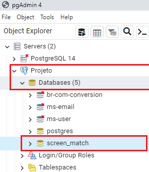
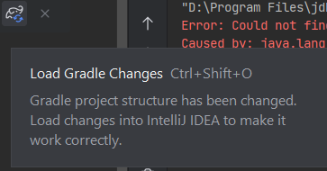
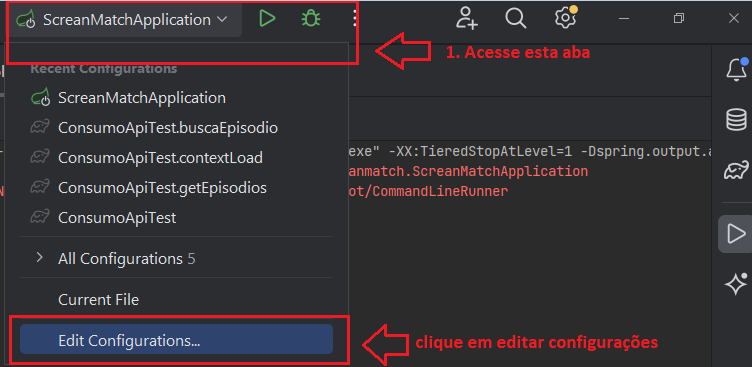
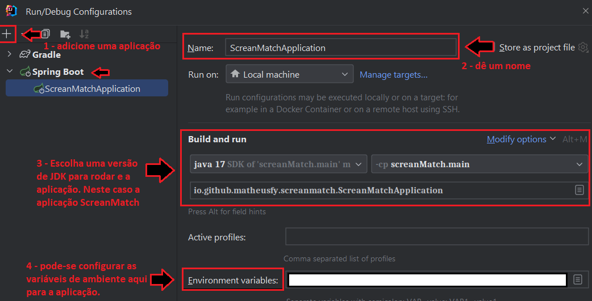

# screenMatch

Este projeto busca filmes, séries e episódios na api da omdb e mostra informações a usuários. Realiza a persistência dessas informações no banco local e disponibiliza um histórico de séries buscadas para o usuários.

## ⚙️ Configuração do projeto

Para configurar o projeto, siga as etapas abaixo:

  1. Clone o repositório do projeto:
    
    git clone https://github.com/matheusfy/screenMatch.git
    

  2. Acesse o diretório do projeto:

    cd screenMatch

  3. Configuração de variáveis de ambiente:

     - `OPENAI_TOKEN`: gere seu próprio token em [OpenAi Website](https://openai.com/)
     - `DB_NAME`: Atribua o nome do seu banco de dados ex: '**postgresql**'
     - `DB_USER`: Atribua o nome do seu user do banco ex: '**postgres**'
     - `DB_PASSWORD`: senha utilizado para acessar a base de dados criada.
     - `DB_HOST`: O host para acessar o banco ex: '**localhost**'
     - `DB_PORT`: A porta para acessar seu banco de dados: **5432**
     - `OMDB_APIKEY`: obtenha sua key da API da omdb em: [omdbapi](https://omdbapi.com/apikey.aspx)

  4. Configure para que o projeto seja compilado utilizando Java 17

  5. Utilizando o banco de dados `postgres`, caso seja a sua primeira vez, crie usuário e uma senha para acesso e uma base de dados. 
   

## 🔨 Funcionalidades do projeto

<!-- Indique quais são as funcionalidades e comportamentos do App

Se possível, apresente um exemplo visual do projeto, seja gif, imagens ou vídeo, abaixo segue um exemplo:

 -->

- `Funcionalidade 1`: Menu com opções de busca de informações das séries:
  - `1 - Buscar série na web`: retorna ao usuário informações da série caso a série buscada exista
  - `2 - Buscar episódio`: busca para o usuário todos episódios de totas temporadas
  - `3 - Lista séries buscadas`: informa a lista de série que já foi pesquisada ao usuário
  - `4 - Buscar série por título`: Busca uma série no banco de dados dado um titulo informado pelo usuario
  - `5 - Buscar série por atores`: Busca lista de série no banco de dados dado um nome de ator ou uma parte do nome.
  - `6 - Buscar série por categoria`: Busca lista de série dada uma categoria informada.
  - `7 - Buscar as melhor 5 séries avaliadas`: Busca as top 5 séries pela avaliação.
  - `8 - Busque uma série pela temporada e pela avaliação`: Busca uma série dada informação da temporada e da avaliação.
  - `9 - Buscar episódio por trecho `: Busca uma lista de episódios que contém um trecho informado pelo usuário.
  - `10 - Buscar top 5 episodios `: Busca os top 5 episódios de uma série.
- `Funcionalidade 2`: Menu com opções de busca de informações de filmes.
  - `Funcionalidade 2a`: descrição da funcionalidade 2a relacionada à funcionalidade 2

## ✔️ Técnicas e tecnologias utilizadas
- `Java`: Versão 17
- `dependências:`
  - `Jackson`: Para trabalharmos com manipulação de json.
  - `Spring Boot`: versão 3.1.11, sem web
  - `OpenAi`: para conexão com API do chatgpt para tradução das sinopses
  - `data-jpa`: Para trabalhando com persistência dos dados no banco

## 📁 Acesso ao projeto

Para acessar o repositório do projeto clique em -> [Repositório](https://github.com/matheusfy/screenMatch)

## 🛠️ Abrir e rodar o projeto

### Rodando no Intellij:

- 1. Acesse o arquivo de build do gradle `build.gradle.kts` na pasta raiz do projeto e verifique a necessidade de carregamento das dependências: 

- 2. Verifique se seu ambiente foi configurado adequadamente com os passos [configuração](#️-configuração-do-projeto)

- 3. Configure de forma que o intellij execute o arquivo `"ScreanMatchApplication"`
  
  

- 4. Sete as seguintes configurações. Obs: Você pode adicionar as variáveis de ambiente dentro da IDE:

- 5. Não esqueça de verificar a configuração da IDE se a configuração de build para arquivos em java está adequada para a versão o qual estamos trabalhando.

### Rodando no VsCode:

    Em desenvolvimento

## 📚 Mais informações do curso

Projetinho desenvolvido ao longo do curso oferecido pela Alura: [Link curso - Java: persistência de dados e consultas com Spring Data JPA](https://cursos.alura.com.br/course/java-persistencia-dados-consultas-spring-data-jpa)
